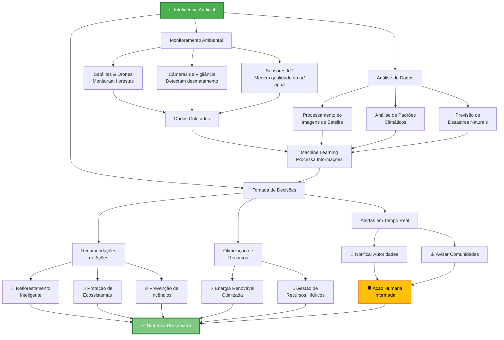

# Fluxograma: IA Auxiliando na Preservação da Natureza

## Explicação do Fluxograma

### **1️⃣ Entrada: Inteligência Artificial**
A IA atua em três frentes principais:
- **Monitoramento Ambiental**: Coleta dados contínuos do ambiente
- **Análise de Dados**: Processa e interpreta grandes volumes de informações
- **Tomada de Decisões**: Recomenda ações baseadas em insights

### **2️⃣ Monitoramento**
- 🛰️ **Satélites & Drones**: Rastreiam mudanças em florestas em tempo real
- 📹 **Câmeras de Vigilância**: Detectam atividades ilegais de desmatamento
- 📊 **Sensores IoT**: Medem qualidade de ar, água e solo

### **3️⃣ Processamento**
- Análise de imagens de satélite para detectar mudanças
- Identificação de padrões climáticos anômalos
- Previsão de furacões, enchentes e outros desastres

### **4️⃣ Tomada de Decisão**
Três tipos de ação:
- **Alertas**: Notificam autoridades e comunidades de ameaças
- **Recomendações**: Guiam reflorestamento e proteção de ecossistemas
- **Otimização**: Melhora gestão de energia e recursos hídricos

### **5️⃣ Resultado Final**
✅ **Natureza Preservada** através da ação humana informada e inteligente

## Exemplos Práticos

| Aplicação | IA Utiliza | Benefício |
|-----------|-----------|-----------|
| Monitoramento de Florestas | Visão computacional + Satélites | Detectar desmatamento em minutos |
| Prevenção de Incêndios | Análise de padrões + Alertas | Reduzir destruição de habitats |
| Proteção de Espécies | Reconhecimento de imagem + GPS | Rastrear animais em perigo |
| Reflorestamento | Otimização de recursos | Plantar 1000x mais árvores |
| Gestão de Pesca | Previsão de estoques | Evitar sobrepesca |

---

**Conclusão**: A IA não substitui o ser humano, mas o capacita a tomar decisões mais rápidas e precisas para proteger nosso planeta! 🌍💚
